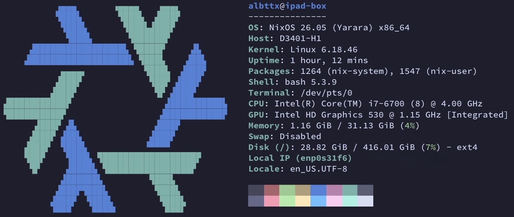

<p align="center">
  
</p>

# ipad-box

Hetzner dedicated NixOS box (`x86_64-linux`). Flake output: `nixosConfigurations.ipad-box`.

```sh
# on the machine
make switch
# or
nixos-rebuild switch --flake .#ipad-box
```

User config can be applied without a full system rebuild:

```sh
make switch.home-manager
```

## Services

Container services live under [`services/`](services/). The engine is Docker
(not Podman) and it is also the `oci-containers` backend, so declarative
containers added later inherit it. `albttx` is in the `docker` group, so
`docker` / `docker compose` work without sudo.

### Traefik

Every HTTP service goes through Traefik at `*.box.albttx.tech`, reachable from
the tailnet only:

| Service | URL |
| --- | --- |
| Shelfmark | https://shelfmark.box.albttx.tech |
| Traefik dashboard | https://traefik.box.albttx.tech |

Traefik listens on `:80`/`:443` on every interface, but it is an ordinary
process, so the NixOS firewall applies — those ports are deliberately *not* in
`allowedTCPPorts`, and `tailscale0` is a trusted interface. **Adding 80/443 to
`allowedTCPPorts` would publish every service on the Hetzner WAN address.**

Adding a service is one line in `services/traefik.nix`:

```nix
backends = {
  shelfmark = "http://127.0.0.1:8084";
  newthing  = "http://127.0.0.1:9000";   # -> newthing.box.albttx.tech
};
```

#### One-time setup

DNS — point the wildcard at the tailnet address (`tailscale ip -4`):

```
*.box.albttx.tech.  A  100.84.177.17
```

Public records, private address: they resolve for everyone, but only tailnet
nodes can route to them.

Certificates are Let's Encrypt wildcards over DNS-01 (HTTP-01 cannot work — LE
cannot reach a tailnet address — and only DNS-01 issues wildcards). That needs
a Cloudflare token with `Zone:DNS:Edit` + `Zone:Zone:Read` on `albttx.tech`, in
a root-only file kept out of `/nix/store`:

```sh
sudo install -d -m 0700 /etc/traefik
printf 'CLOUDFLARE_DNS_API_TOKEN=%s\n' "$TOKEN" | sudo install -m 0600 /dev/stdin /etc/traefik/cloudflare.env
sudo systemctl restart traefik
```

`traefik.service` will not start until that file exists. Certs land in
`/var/lib/traefik/acme.json`.

### Shelfmark

Official image `ghcr.io/calibrain/shelfmark` published on loopback `:8084`;
Traefik fronts it. Data: `/var/lib/shelfmark/{config,books}`. Enable
authentication in Settings before sharing the node further.

Systemd unit: `docker-shelfmark`. Bump the tag in `services/shelfmark.nix` to
update.
